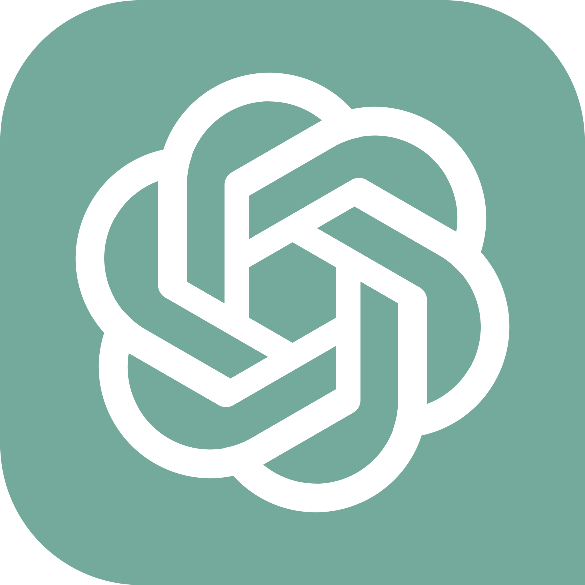

<p align="center">
  
</p>

<h1 align="center">Fusion AI</h1>

<p align="center">
  <strong>Compare AI models side-by-side, in real time.</strong><br/>
  One prompt. Multiple AI responses. Instant insights.<br/><br/>
  🚀 <strong>Live Demo:</strong> <a href="https://fusion-ai-lake.vercel.app/">fusion-ai-lake.vercel.app</a>
</p>

<p align="center">
  
  
  
  
  
  
</p>

---

## 📌 Table of Contents

- [Overview](#-overview)
- [Key Features](#-key-features)
- [Architecture & Tech Stack](#-architecture--tech-stack)
- [AI Models Supported](#-ai-models-supported)
- [Project Structure](#-project-structure)
- [Getting Started](#-getting-started)
- [Environment Variables](#-environment-variables)
- [API Reference](#-api-reference)
- [Authentication & Authorization](#-authentication--authorization)
- [Rate Limiting & Security](#-rate-limiting--security)
- [Deployment](#-deployment)
- [Roadmap](#-roadmap)
- [Contributing](#-contributing)
- [License](#-license)

---

## 🌐 Overview

**Fusion AI** is a modern, full-stack AI chat aggregator that lets users query **multiple large language models simultaneously** and compare their outputs side-by-side in a beautiful, responsive interface.

Instead of switching between ChatGPT, Gemini, and Claude in separate tabs, Fusion AI gives you **one unified workspace** — send a single message and instantly see how GPT, Gemini, DeepSeek, Mistral, Grok, Cohere, and Llama each respond. This empowers developers, researchers, and AI enthusiasts to:

- **Evaluate response quality** across models for any given prompt
- **Identify strengths and weaknesses** of different LLMs in real time
- **Save time** with a single-prompt, multi-model workflow
- **Persist conversations** across sessions with cloud-backed chat history

---

## ✨ Key Features

### 🧠 Multi-Model Simultaneous Chat
Send one message, get parallel responses from up to **7 AI models** at once. Each model runs in its own panel with independent sub-model selection, toggle controls, and streaming conversation history.

### 🔀 Dynamic Model Panel Management
- **Toggle** any model panel on or off with a single click
- **Collapse** panels to icons when not in use — saving screen real estate
- **Switch sub-models** per provider (e.g., GPT-3.5 → GPT-5, Gemini Flash → Gemini Pro)
- **Free & Premium tiers** — premium models are locked behind a paywall with clear visual indicators

### 🔐 Enterprise-Grade Authentication
Powered by **Clerk**, supporting:
- Email / password sign-up & sign-in
- OAuth social logins (Google, GitHub, etc.)
- Session-based modal authentication (no page redirects)
- Subscription plan gating via Clerk's `has({ plan })` API

### 💬 Persistent Chat History
- Conversations are stored in **Firebase Firestore** in real time
- Full chat history is displayed in the sidebar, sorted by recency
- Click any past chat to reload the full conversation with all model responses
- **Delete chats** with a single click (with optimistic UI updates)
- New chat sessions are created with UUID-based unique identifiers

### 💳 Freemium Credit System
- **Free users**: 5 messages per day (auto-refilling via Arcjet token bucket)
- **Premium users**: Unlimited messages + access to premium models (GPT-5, Gemini Pro, DeepSeek R1-0528, etc.)
- Visual credit progress bar in the sidebar
- In-app upgrade modal powered by Clerk's `<PricingTable />`

### 🛡️ Rate Limiting & API Security
- **Arcjet** token-bucket rate limiter integrated at the API route level
- Per-user rate tracking (keyed by email address)
- 5-token capacity with 24-hour refill cycle
- Graceful 429 responses when limits exceed

### 🌓 Dark Mode / Light Mode
- System-aware theme detection via `next-themes`
- One-click toggle in the sidebar header
- All UI components respect the active theme seamlessly

### 📱 Responsive Sidebar Layout
- Collapsible sidebar using `shadcn/ui` SidebarProvider
- Mobile-optimized with the `useMobile` hook
- Sidebar persists navigation, chat history, credits, and settings

### 📝 Rich Markdown Rendering
- AI responses are rendered with full **GitHub Flavored Markdown** support
- Tables, code blocks, lists, bold, italic, strikethrough — all rendered beautifully
- Powered by `react-markdown` + `remark-gfm`

---

## 🏗️ Architecture & Tech Stack

| Layer | Technology | Purpose |
|---|---|---|
| **Framework** | Next.js 16 (App Router) | SSR, API routes, file-based routing |
| **UI Library** | React 19 | Component-based UI |
| **Styling** | Tailwind CSS 4 + shadcn/ui | Utility-first CSS + accessible component library |
| **Authentication** | Clerk | User auth, session management, subscription plans |
| **Database** | Firebase Firestore | Real-time NoSQL cloud database for users & chat history |
| **AI Gateway** | KravixStudio API | Unified API gateway to 7+ LLM providers |
| **Rate Limiting** | Arcjet | Token-bucket rate limiter with per-user tracking |
| **State Management** | React Context API | App-wide state for models, messages, user details |
| **HTTP Client** | Axios | API communication |
| **Deployment** | Vercel | Zero-config production deployment |
| **Fonts** | Geist Sans & Geist Mono | Modern, clean typography |

### High-Level Architecture

```
┌─────────────────────────────────────────────────────────────┐
│                        Client (Browser)                      │
│  ┌─────────────┐  ┌──────────────┐  ┌────────────────────┐  │
│  │  AppSidebar  │  │  ChatInput   │  │  AiMultiModels     │  │
│  │  - History   │  │  - Send msg  │  │  - 7 model panels  │  │
│  │  - Credits   │  │  - Auth gate │  │  - Markdown render │  │
│  │  - Theme     │  │              │  │  - Sub-model select│  │
│  └──────┬───────┘  └──────┬───────┘  └────────┬───────────┘  │
│         │                 │                    │              │
│         └─────────────────┼────────────────────┘              │
│                           │                                   │
│              React Context (Provider.jsx)                     │
│         ┌─────────────────┼─────────────────┐                │
│         │  AiSelectedModelContext            │                │
│         │  UserDetailContext                 │                │
│         └─────────────────┬─────────────────┘                │
└───────────────────────────┼──────────────────────────────────┘
                            │  HTTPS
                            ▼
┌───────────────────────────────────────────────────────────────┐
│                    Next.js API Routes                         │
│  ┌────────────────────┐  ┌─────────────────────────────────┐ │
│  │ /api/ai-multi-model│  │ /api/user-remaining-msg         │ │
│  │ - Arcjet protect   │  │ - Arcjet remaining token check  │ │
│  │ - KravixStudio call│  │ - Returns credit count          │ │
│  └─────────┬──────────┘  └─────────────────────────────────┘ │
└────────────┼─────────────────────────────────────────────────┘
             │
     ┌───────┴────────┐          ┌──────────────────┐
     │  KravixStudio   │          │  Firebase         │
     │  AI Gateway     │          │  Firestore        │
     │  (7+ LLMs)      │          │  - users          │
     └────────────────┘          │  - chatHistory    │
                                  └──────────────────┘
```

---

## 🤖 AI Models Supported

Fusion AI connects to **7 major AI providers** through the KravixStudio unified gateway:

| Provider | Free Sub-Models | Premium Sub-Models | Icon |
|---|---|---|---|
| **GPT** (OpenAI) | GPT-3.5, GPT-3.5 Turbo, GPT-4.1 Mini, GPT-5 Nano, GPT-5 Mini | GPT-4.1, GPT-5 |  |
| **Gemini** (Google) | Gemini 2.5 Lite, Gemini 2.5 Flash | Gemini 2.5 Pro |  |
| **DeepSeek** | DeepSeek R1 | DeepSeek R1-0528 |  |
| **Mistral** | Ministral 3B | Mistral Medium 2505 |  |
| **Grok** (xAI) | Grok 3 Mini | Grok 3 |  |
| **Cohere** | Command A, Command R | — |  |
| **Llama** (Meta) | Llama 3.3 70B Instruct | Llama 4 Scout 17B |  |

> **Note:** Premium models require an active subscription via Clerk's billing system.

---

## 📁 Project Structure

```
Fusion-AI/
├── app/
│   ├── _components/              # Core UI components
│   │   ├── AiMultiModels.jsx     # Multi-model chat panels with toggles & sub-model selectors
│   │   ├── AppHeader.jsx         # Top header with auth controls (Sign In / Logout)
│   │   ├── AppSidebar.jsx        # Sidebar: branding, new chat, history, credits, settings
│   │   ├── ChatInputBox.jsx      # Chat input with message send, auth gating, credit checks
│   │   ├── PricingModal.jsx      # Upgrade modal with Clerk PricingTable integration
│   │   └── UserCreditProgress.jsx# Visual credit/progress bar for free users
│   │
│   ├── api/                      # Next.js API routes (server-side)
│   │   ├── ai-multi-model/
│   │   │   └── route.js          # POST — Proxies user prompts to KravixStudio AI gateway
│   │   ├── arcjet-test/
│   │   │   └── route.js          # GET — Arcjet integration test endpoint
│   │   └── user-remaining-msg/
│   │       └── route.js          # GET — Returns user's remaining daily message credits
│   │
│   ├── settings/                 # (Reserved) User settings page
│   ├── globals.css               # Global styles, CSS variables, dark mode, custom scrollbar
│   ├── layout.js                 # Root layout: Clerk, fonts, Toaster
│   ├── page.js                   # Home page — renders ChatInputBox
│   └── provider.jsx              # Global providers: themes, contexts, sidebar, user init
│
├── components/
│   └── ui/                       # shadcn/ui components
│       ├── button.jsx            # Button variants (default, outline, ghost, etc.)
│       ├── dialog.jsx            # Modal dialog
│       ├── input.jsx             # Input field
│       ├── progress.jsx          # Progress bar
│       ├── select.jsx            # Dropdown select
│       ├── separator.jsx         # Horizontal separator
│       ├── sheet.jsx             # Slide-over sheet
│       ├── sidebar.jsx           # Full sidebar primitives
│       ├── skeleton.jsx          # Loading skeleton
│       ├── sonner.jsx            # Toast notification provider
│       ├── switch.jsx            # Toggle switch
│       └── tooltip.jsx           # Tooltip
│
├── config/
│   ├── Arcjet.js                 # Arcjet rate limiter config (token bucket, 5/day)
│   └── FirebaseConfig.js         # Firebase initialization & Firestore export
│
├── context/
│   ├── AiSelectedModelContext.js  # Context for selected models, messages, chat state
│   └── UserDetailContext.js       # Context for user profile and credit info
│
├── hooks/
│   ├── use-mobile.js             # Responsive breakpoint hook
│   └── useSubscription.js        # Clerk subscription check (isPaidUser)
│
├── lib/
│   └── utils.js                  # Utility functions (cn — class merge helper)
│
├── shared/
│   ├── AiModelList.jsx           # Full AI model registry (7 providers, 18+ sub-models)
│   └── AiModelsShared.jsx        # Default model configuration map
│
├── public/                       # Static assets
│   ├── logo.svg                  # Fusion AI logo
│   ├── gpt.png                   # GPT provider icon
│   ├── gemini.png                # Gemini provider icon
│   ├── deepseek.png              # DeepSeek provider icon
│   ├── mistral.png               # Mistral provider icon
│   ├── grok.png                  # Grok provider icon
│   ├── cohere.png                # Cohere provider icon
│   └── llama.png                 # Llama provider icon
│
├── .env.example                  # Environment variable template (safe to commit)
├── .gitignore                    # Git ignore rules
├── next.config.mjs               # Next.js configuration
├── package.json                  # Dependencies & scripts
├── postcss.config.mjs            # PostCSS configuration
└── README.md                     # ← You are here
```

---

## 🚀 Getting Started

### Prerequisites

| Requirement | Version |
|---|---|
| Node.js | ≥ 18.x |
| npm | ≥ 9.x |
| Git | Latest |

You will also need accounts (free tiers available) on:
- [Firebase](https://console.firebase.google.com/) — for Firestore database
- [Clerk](https://clerk.com/) — for authentication & subscriptions
- [Arcjet](https://arcjet.com/) — for rate limiting
- [KravixStudio](https://kravixstudio.com/) — for the AI model gateway

### Installation

```bash
# 1. Clone the repository
git clone https://github.com/your-username/Fusion-AI.git
cd Fusion-AI

# 2. Install dependencies
npm install

# 3. Set up environment variables
cp .env.example .env
# Then edit .env with your actual keys (see section below)

# 4. Start the development server
npm run dev
```

The app will be running at **http://localhost:3000** 🎉

---

## 🔑 Environment Variables

Create a `.env` file in the project root (use `.env.example` as a template):

| Variable | Required | Description |
|---|---|---|
| `NEXT_PUBLIC_FIREBASE_API_KEY` | ✅ | Firebase Web API key |
| `NEXT_PUBLIC_FIREBASE_AUTH_DOMAIN` | ✅ | Firebase auth domain |
| `NEXT_PUBLIC_FIREBASE_PROJECT_ID` | ✅ | Firebase project ID |
| `NEXT_PUBLIC_FIREBASE_STORAGE_BUCKET` | ✅ | Firebase storage bucket URL |
| `NEXT_PUBLIC_FIREBASE_MESSAGING_SENDER_ID` | ✅ | Firebase Cloud Messaging sender ID |
| `NEXT_PUBLIC_FIREBASE_APP_ID` | ✅ | Firebase application ID |
| `NEXT_PUBLIC_FIREBASE_MEASUREMENT_ID` | ❌ | Google Analytics measurement ID |
| `NEXT_PUBLIC_CLERK_PUBLISHABLE_KEY` | ✅ | Clerk publishable key (client-side) |
| `CLERK_SECRET_KEY` | ✅ | Clerk secret key (server-side only) |
| `ARCJET_KEY` | ✅ | Arcjet site key for rate limiting |
| `KRAVIXSTUDIO_API_KEY` | ✅ | KravixStudio API key for AI model access |

> ⚠️ **Security**: Variables prefixed with `NEXT_PUBLIC_` are exposed to the browser. Server-only secrets (`CLERK_SECRET_KEY`, `ARCJET_KEY`, `KRAVIXSTUDIO_API_KEY`) are never sent to the client.

---

## 📡 API Reference

### `POST /api/ai-multi-model`

Sends a user message to a specific AI model through the KravixStudio gateway.

**Request Body:**
```json
{
  "message": [{ "role": "user", "content": "Explain quantum computing" }],
  "model": "gpt-4.1-mini",
  "parentModel": "GPT"
}
```

**Response (200):**
```json
{
  "aiResponse": "Quantum computing is a type of computation that...",
  "model": "GPT"
}
```

**Error (429):**
```json
{ "error": "Rate limit exceeded" }
```

---

### `GET /api/user-remaining-msg`

Returns the authenticated user's remaining daily message credits.

**Response (200):**
```json
{ "remainingToken": 3 }
```

---

## 🔐 Authentication & Authorization

Fusion AI uses **Clerk** for a complete auth experience:

| Feature | Implementation |
|---|---|
| Sign Up / Sign In | Modal-based via `<SignInButton mode="modal" />` |
| Session Management | Clerk's built-in secure sessions |
| Sign Out | `<SignOutButton>` in the app header |
| Protected Routes | Chat input disabled for unauthenticated users |
| Subscription Gating | `useSubscription()` hook checks `has({ plan: 'unlimited_plan' })` |
| Upgrade Flow | Clerk's `<PricingTable />` rendered in a modal dialog |

### Access Control Matrix

| Action | Guest | Free User | Pro User |
|---|---|---|---|
| View AI panels | ✅ | ✅ | ✅ |
| Send messages | ❌ | ✅ (5/day) | ✅ (Unlimited) |
| Use free models | ❌ | ✅ | ✅ |
| Use premium models | ❌ | ❌ | ✅ |
| Chat history | ❌ | ✅ | ✅ |
| Delete chats | ❌ | ✅ | ✅ |

---

## 🛡️ Rate Limiting & Security

### Arcjet Token Bucket

The application implements a **token bucket** rate limiter via Arcjet:

```
Algorithm:   Token Bucket
Capacity:    5 tokens
Refill Rate: 5 tokens per 24 hours
Tracking:    Per-user (email address)
Mode:        DRY_RUN (configurable to LIVE)
```

This means each free user gets **5 messages per day**, which automatically refill every 24 hours. The remaining credit count is displayed in real-time in the sidebar.

### Security Measures

- ✅ Server-side API key protection (KravixStudio key never exposed to client)
- ✅ Per-user rate limiting prevents API abuse
- ✅ Clerk-managed authentication with secure session tokens
- ✅ Environment variable separation (public vs. server-only)
- ✅ Input validation on API routes

---

## ☁️ Deployment

Fusion AI is optimized for **Vercel** deployment:

```bash
# Build for production
npm run build

# Or deploy directly via Vercel CLI
npx vercel --prod
```

### Vercel Configuration

1. Import your GitHub repository on [vercel.com](https://vercel.com)
2. Add all environment variables from `.env.example` to your Vercel project settings
3. Deploy — Vercel auto-detects the Next.js framework

> **Tip:** Set the `ARCJET_KEY` and `KRAVIXSTUDIO_API_KEY` as encrypted environment variables in Vercel for maximum security.

---

## 🗺️ Roadmap

- [ ] 🔍 **Streaming Responses** — Real-time token-by-token streaming from all models
- [ ] 📎 **File Attachments** — Upload images and documents for multimodal prompts
- [ ] 🎤 **Voice Input** — Speech-to-text integration
- [ ] 📊 **Response Analytics** — Compare response times, token counts, and quality metrics
- [ ] 🔗 **Shareable Conversations** — Generate public links to share comparisons
- [ ] 🧩 **Plugin System** — Custom model integrations and tools
- [ ] 🌍 **i18n** — Multi-language UI support
- [ ] 📱 **Mobile App** — React Native companion app

---

## 🤝 Contributing

Contributions are welcome! Here's how to get started:

1. **Fork** the repository
2. **Create** a feature branch (`git checkout -b feature/amazing-feature`)
3. **Commit** your changes (`git commit -m 'Add amazing feature'`)
4. **Push** to the branch (`git push origin feature/amazing-feature`)
5. **Open** a Pull Request

Please make sure to:
- Follow the existing code style
- Add comments for complex logic
- Test your changes locally before submitting

---

## 📄 License

This project is licensed under the **MIT License** — see the [LICENSE](LICENSE) file for details.

---

<p align="center">
  Built with ❤️ using Next.js, Firebase, Clerk, and the power of multiple AI models.
  <br/>
  <strong>Fusion AI</strong> — Because one AI is never enough.
</p>
